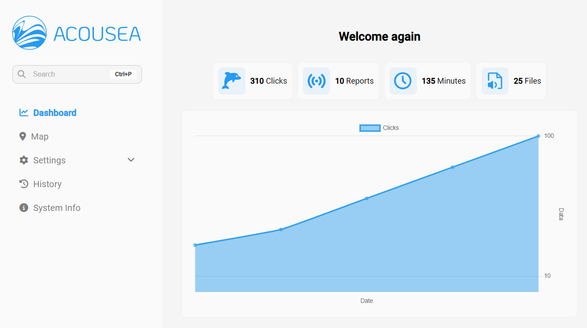
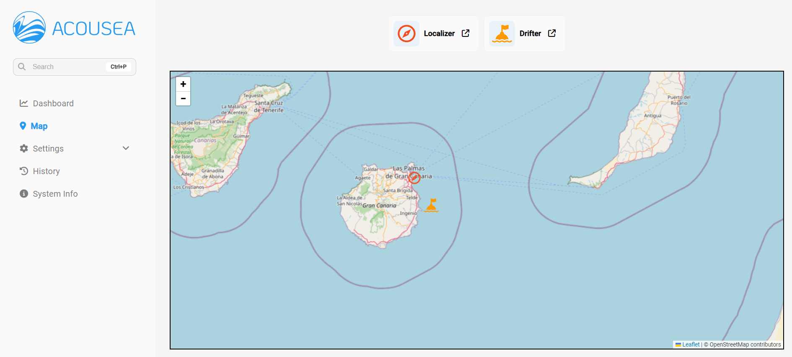
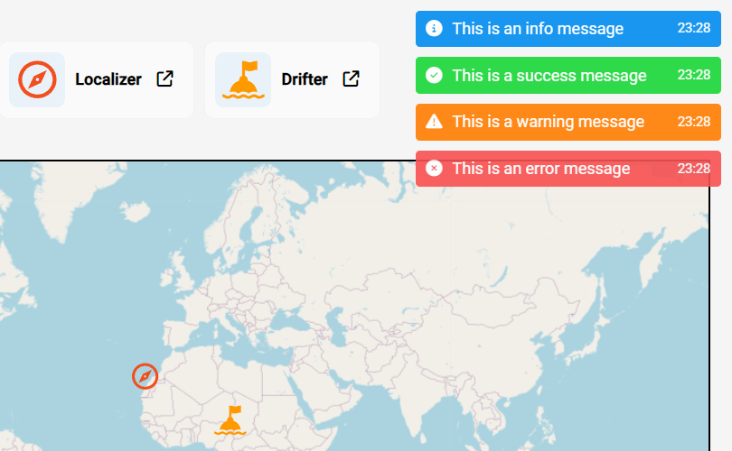
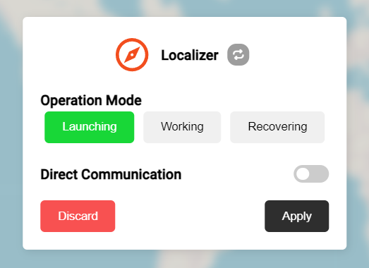
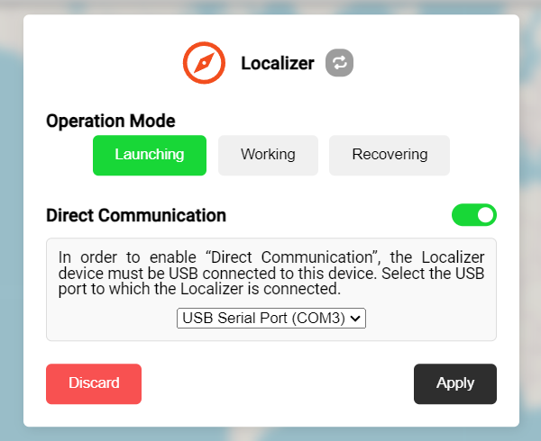
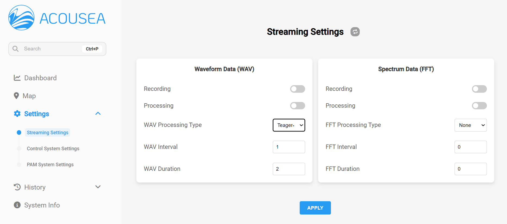
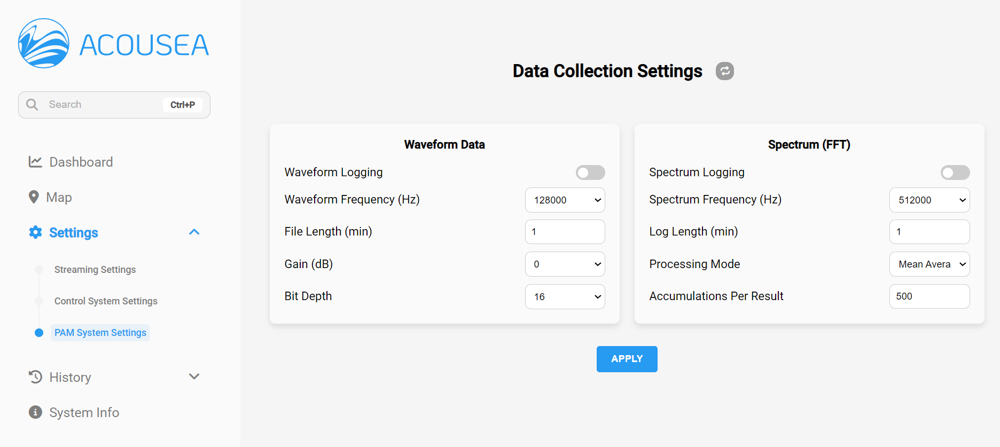
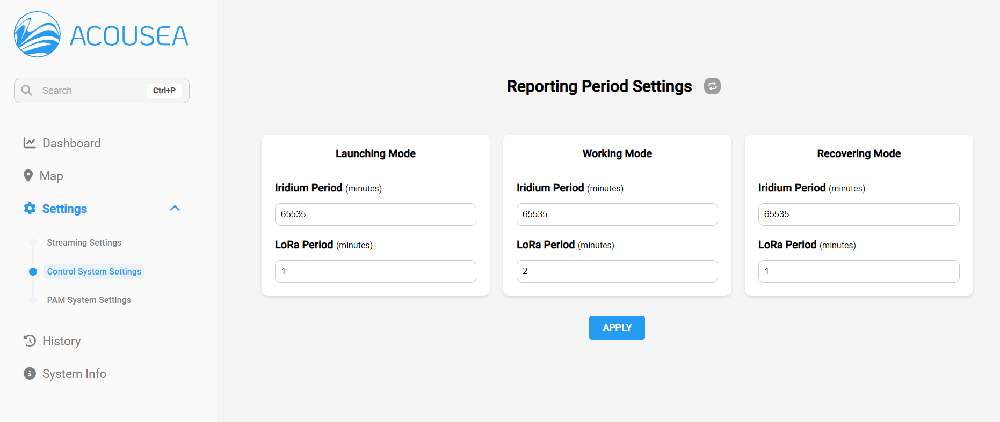
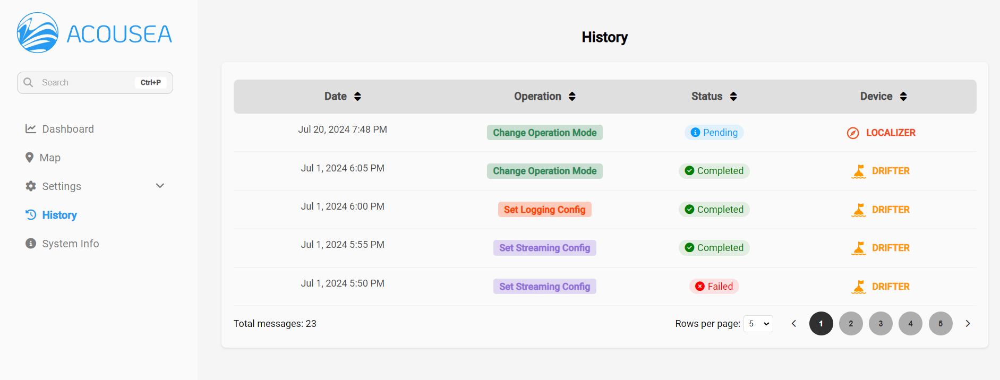
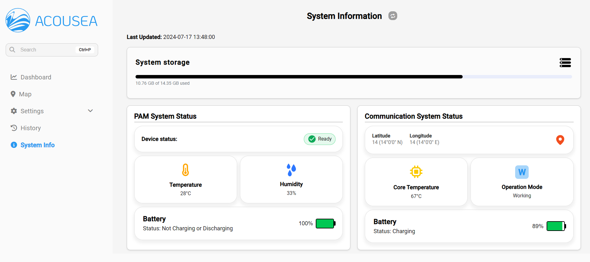

# Acousea: Sistema de Control y Comunicaciones para el Derivador Oceánico

Acousea es la interfaz frontend desarrollada con Angular para la gestión y monitoreo del derivador oceánico. Esta plataforma proporciona herramientas para la configuración y supervisión de los dispositivos `Localizer` y `Drifter`, y el correspondiente módulo PAM.

## Requisitos

Antes de comenzar, asegúrate de tener instalados los siguientes requisitos:

- Node.js (v14 o superior)
- Angular CLI (v12 o superior)
- NPM (v6 o superior)

## Instalación

Clona el repositorio a tu máquina local:
```bash
git clone [URL_DEL_REPOSITORIO]
cd DIRECTORIO_DEL_PROYECTO
```

Instala las dependencias necesarias:
```bash
npm install
```

## Ejecución del Proyecto

Para ejecutar el proyecto en modo desarrollo, utiliza el siguiente comando:
```bash
ng serve
```
Esto iniciará el servidor de desarrollo y podrás acceder a la aplicación en `http://localhost:4200/`.

## Estructura del Proyecto

El proyecto está estructurado en varias secciones, cada una correspondiente a una funcionalidad específica del sistema:

- **Dashboard**
- **Mapa**
- **Notificaciones**
- **Pop-Ups para Configuración**
- **Ajustes**
- **Historial de Operaciones**
- **Información del Sistema**

### Dashboard

En el **Panel Principal** o **Dashboard**, se puede observar un resumen de las detecciones realizadas, el número de reportes recibidos, minutos de grabación y el número de archivos generados. Además, se proporciona una representación gráfica de estos datos a lo largo del tiempo.



### Mapa

El apartado de **Mapa** muestra la última ubicación conocida tanto del dispositivo `Localizer` como del `Drifter`. Esta visualización es fundamental para tener una vista clara y precisa de la posición de ambos dispositivos.



#### Notificaciones

La página web notifica aquellos eventos de interés mediante notificaciones que se muestran en la esquina superior derecha de la pantalla. Existen cuatro tipos de notificaciones:

- **Información (azul):** Proporciona información general o confirmaciones de acciones no críticas.
- **Éxito (verde):** Indica que una acción se ha completado correctamente.
- **Aviso (naranja):** Avisa al usuario de situaciones que requieren atención, pero que no son críticas.
- **Error (rojo):** Informa al usuario de errores o problemas que requieren una acción inmediata.



#### Pop-Ups para Configuración de los Dispositivos

La página de Mapa cuenta con **Pop-Ups** que permiten la configuración detallada de los dispositivos `Localizer` y `Drifter`. Estos pop-ups ofrecen opciones para la gestión del modo de operación y la activación o desactivación de la comunicación directa.




### Ajustes

#### Ajustes del Streaming

Esta sección permite modificar la configuración del módulo de streaming de datos acústicos de la API. Existen dos aspectos principales configurables: audio (WAV) y la Transformada Rápida de Fourier (FFT).



#### Ajustes del Sistema PAM

Esta subsección permite modificar la configuración de recolección de datos del sistema PAM, incluyendo parámetros como la frecuencia de muestreo, la duración de los archivos y otros aspectos relevantes para la grabación y procesamiento de datos acústicos.



#### Ajuste de los Períodos de Reporte (Drifter)

En la sección de **Configuración**, los usuarios pueden ajustar los períodos de reporte para los tres modos operativos del `Drifter`: **Launching**, **Working** y **Recovering**.



### Historial de Operaciones

La sección de **Historial** proporciona un registro de las operaciones realizadas, permitiendo llevar un seguimiento de los cambios solicitados y eventos que han ocurrido en el sistema a lo largo del tiempo.



### Información del Sistema

El apartado de **Información del Sistema** proporciona una visión detallada del estado tanto del `Drifter` como del sistema PAM, permitiendo a los usuarios tomar decisiones informadas basadas en datos precisos y actualizados.



## Despliegue

Para construir la aplicación para producción, ejecuta:
```bash
ng build --prod
```
Esto generará los archivos necesarios en el directorio `dist/`.


## Contacto

Para cualquier duda o consulta, por favor contacta a [antonio.aparicio101@alu.ulpgc.es](mailto:antonio.aparicio101@alu.ulpgc.es).

